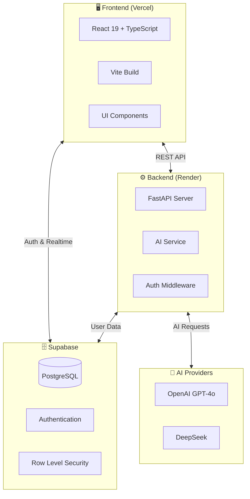
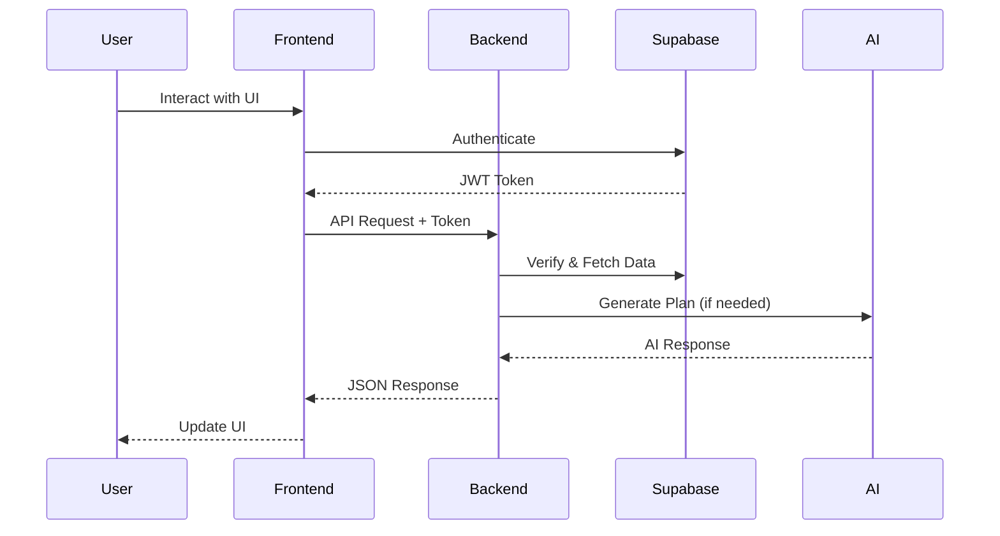

# FitBridge 🏋️

AI-powered fitness app with workout/diet plans, progress tracking, and gamification.

[](https://github.com/your-org/fitbridge/actions)
[](LICENSE)

---

## 🌐 Live Demo

**🚀 [Try FitBridge Live](https://fitbridge-l8518smkn-hashvanth21s-projects.vercel.app/)**

> Experience the full app with AI-powered workout and diet plans, real-time chat, and progress tracking.

---

## ✨ Features

### Core Capabilities

| Feature | Description |
|---------|-------------|
| 🤖 **AI Coach** | Personalized workout & diet plans powered by GPT-4o/DeepSeek |
| 🔥 **Streaks** | Gamified consistency tracking with XP rewards |
| 📊 **Analytics** | Progress charts, calorie tracking, and workout stats |
| 💬 **AI Chat** | Real-time conversations with AI fitness coach |
| 📱 **Mobile-First** | Responsive design optimized for all devices |

### AI-Powered Features

| Feature | How It Works |
|---------|-------------|
| **Workout Plan Generation** | AI creates personalized workout routines based on goals, fitness level, and available equipment |
| **Diet Plan Generation** | Custom meal plans with calorie targets, macros, and regional cuisine preferences (Indian, Mediterranean, etc.) |
| **Chat with AI Coach** | Ask fitness questions, get form tips, nutrition advice, and motivation in real-time |

### Authentication & Data

| Feature | Technology |
|---------|------------|
| **Supabase Auth** | Secure email/password authentication with session management |
| **Real-time Sync** | Instant data updates across devices using Supabase real-time |
| **Row Level Security** | User data is isolated and protected at the database level |

---

## 🏗️ Architecture

### System Overview



### Detailed Architecture

```text
┌────────────────────────────────────────────────────────────────┐
│                         CLIENT                                  │
│  ┌──────────────────────────────────────────────────────────┐  │
│  │  React 19 + TypeScript + Vite                            │  │
│  │  ├── components/    UI Components                        │  │
│  │  ├── services/      API Client, Supabase Client          │  │
│  │  └── tests/         Vitest + React Testing Library       │  │
│  └──────────────────────────────────────────────────────────┘  │
└────────────────────────────────┬───────────────────────────────┘
                             │ HTTP/SSE
                             ▼
┌────────────────────────────────────────────────────────────────┐
│                       BACKEND (FastAPI)                         │
│  ┌──────────────────────────────────────────────────────────┐  │
│  │  app/routers/       API Endpoints                        │  │
│  │  app/services/      AI Service, Supabase Service         │  │
│  │  tests/             pytest + httpx                       │  │
│  └──────────────────────────────────────────────────────────┘  │
└────────────────────────────────┬───────────────────────────────┘
                             │
              ┌──────────────┴──────────────┐
              ▼                              ▼
┌─────────────────────────┐    ┌─────────────────────────┐
│      SUPABASE           │    │     AI PROVIDERS        │
│  ├── PostgreSQL DB      │    │  ├── OpenAI GPT-4o      │
│  ├── Authentication     │    │  └── DeepSeek           │
│  └── Row Level Security │    │                         │
└─────────────────────────┘    └─────────────────────────┘
```

### Data Flow



---

## 🚀 Quick Start

### Prerequisites

| Tool | Version |
|------|---------|
| Node.js | 20+ |
| Python | 3.10+ |
| npm | 10+ |

### Setup

```bash
# Clone
git clone https://github.com/your-org/fitbridge.git
cd fitbridge

# Frontend
npm install
cp .env.example .env

# Backend
cd backend
python -m venv venv
venv\Scripts\activate  # Windows
pip install -r requirements.txt
cp .env.example .env

# Start both
cd ..
npm run dev
```

---

## 🚀 Production Setup

### Environment Variables

#### Frontend (`.env`)

| Variable | Description | Required |
|----------|-------------|----------|
| `VITE_API_URL` | Backend API URL (e.g., `https://fitbridge-api.onrender.com`) | ✅ |
| `VITE_SUPABASE_URL` | Supabase project URL | ✅ |
| `VITE_SUPABASE_ANON_KEY` | Supabase anonymous key | ✅ |

#### Backend (`backend/.env`)

| Variable | Description | Required |
|----------|-------------|----------|
| `SUPABASE_URL` | Supabase project URL | ✅ |
| `SUPABASE_ANON_KEY` | Supabase anonymous key | ✅ |
| `SUPABASE_SERVICE_ROLE_KEY` | Supabase service role key (admin) | ✅ |
| `OPENAI_API_KEY` | OpenAI API key | ⚡ |
| `OPENAI_MODEL` | Model to use (default: `gpt-4o`) | ❌ |
| `DEEPSEEK_API_KEY` | DeepSeek API key (alternative) | ⚡ |
| `AI_PROVIDER` | `openai` or `deepseek` | ✅ |
| `HOST` | Server host (default: `0.0.0.0`) | ❌ |
| `PORT` | Server port (default: `8000`) | ❌ |
| `CORS_ORIGINS` | Allowed CORS origins (comma-separated) | ✅ |
| `JWT_SECRET` | JWT signing secret | ✅ |

> ⚡ = Required based on selected `AI_PROVIDER`

### Deployment Instructions

#### Frontend (Vercel)

```bash
# Install Vercel CLI
npm i -g vercel

# Deploy
vercel --prod
```

Configure environment variables in Vercel Dashboard → Settings → Environment Variables.

#### Backend (Render)

1. **Connect Repository**: Link your GitHub repo to Render
2. **Configure Service**:
   - **Build Command**: `pip install -r requirements.txt`
   - **Start Command**: `uvicorn app.main:app --host 0.0.0.0 --port $PORT`
   - **Root Directory**: `backend`
3. **Set Environment Variables**: Add all backend variables in Render dashboard
4. **Deploy**: Render auto-deploys on push to main

Alternatively, use the Blueprint:

```bash
# One-click deploy with render.yaml
https://render.com/deploy?repo=https://github.com/your-org/fitbridge
```

### Backend Health Checks

| Endpoint | Method | Description |
|----------|--------|-------------|
| `/health` | GET | Basic health check, returns `{"status": "healthy"}` |
| `/docs` | GET | Interactive API documentation (Swagger UI) |
| `/redoc` | GET | Alternative API docs (ReDoc) |

**Check health:**

```bash
# Local
curl http://localhost:8000/health

# Production
curl https://fitbridge-api.onrender.com/health
```

**Expected response:**

```json
{
  "status": "healthy",
  "version": "1.0.0"
}
```

---

## 🧪 Testing

```bash
# Frontend
npm run test:run        # Run once
npm run test:coverage   # With coverage

# Backend
cd backend
python -m pytest tests/ -v
```

---

## 📁 Project Structure

```text
fitbridge/
├── components/          # React UI
├── services/            # API clients
├── tests/               # Frontend tests
├── backend/
│   ├── app/routers/     # API endpoints
│   ├── app/services/    # Business logic
│   └── tests/           # Backend tests
├── docs/                # Documentation
│   ├── API.md           # API contracts
│   ├── ARCHITECTURE.md  # Module breakdown
│   └── ISSUES.md        # GitHub issues
└── .github/workflows/   # CI/CD
```

---

## 🤝 Contributing

We welcome contributions! See [CONTRIBUTING.md](CONTRIBUTING.md) for details.

### Expectations

| Requirement | Details |
|-------------|---------|
| Tests | All PRs must pass existing tests |
| Lint | Run `npm run lint` before pushing |
| Format | Run `npm run format` for consistency |
| PRs | Small, focused changes preferred |
| Issues | Check existing issues before starting |

### For Interns

1. Start with issues labeled `good first issue`
2. Read [docs/ARCHITECTURE.md](docs/ARCHITECTURE.md)
3. Review [docs/API.md](docs/API.md) for API contracts
4. Ask questions in PR comments

---

## 🗺️ Roadmap

### Q1 2025: Foundation ✅

- [x] Core workout/diet logging
- [x] AI plan generation
- [x] Streak system
- [x] Basic analytics
- [x] Test infrastructure
- [x] CI/CD pipeline

### Q2 2025: Enhancement

- [ ] Workout templates library
- [ ] Progress photos
- [ ] Export data (CSV)
- [ ] Rest timer
- [ ] Toast notifications
- [ ] Improved empty states

### Q3 2025: Scale

- [ ] React Native mobile app
- [ ] Push notifications
- [ ] Social sharing
- [ ] Weekly email reports
- [ ] Multi-language support

### Q4 2025: Growth

- [ ] Apple Health integration
- [ ] Workout music integration
- [ ] Group challenges
- [ ] Personal trainer mode

---

## 🎯 Milestones

| Milestone | Target | Status |
|-----------|--------|--------|
| **v0.1** - MVP | Dec 2024 | ✅ Done |
| **v0.2** - Testing | Dec 2024 | ✅ Done |
| **v0.3** - Polish | Jan 2025 | 🔄 In Progress |
| **v0.4** - Templates | Feb 2025 | ⏳ Planned |
| **v1.0** - Mobile | Mar 2025 | ⏳ Planned |

### v0.3 Polish (Current)

- [ ] Fix streak edge cases
- [ ] Add loading skeletons
- [ ] Improve error handling
- [ ] Add toast notifications
- [ ] Complete test coverage (70%)

> **Exit Criteria:** v0.3 is complete when all polish items are merged, CI is green, and no P0/P1 issues remain open.

### v0.4 Templates

- [ ] Pre-built workout library
- [ ] Meal plan templates
- [ ] One-click start
- [ ] Template customization

---

## 📚 Documentation

| Doc | Description |
|-----|-------------|
| [API.md](docs/API.md) | Full API contracts with examples |
| [ARCHITECTURE.md](docs/ARCHITECTURE.md) | Module breakdown |
| [ISSUES.md](docs/ISSUES.md) | Ready-to-create GitHub issues |
| [CONTRIBUTING.md](CONTRIBUTING.md) | Contribution guide |
| [ISSUE_BACKLOG.md](ISSUE_BACKLOG.md) | Prioritized task list |

---

## 🛠️ Tech Stack

| Layer | Technology |
|-------|------------|
| Frontend | React 19, TypeScript, Vite |
| Backend | Python, FastAPI |
| Database | Supabase (PostgreSQL) |
| AI | OpenAI, DeepSeek |
| Testing | Vitest, pytest |
| CI/CD | GitHub Actions |

---

## 📄 License

MIT License - See [LICENSE](LICENSE) for details.
