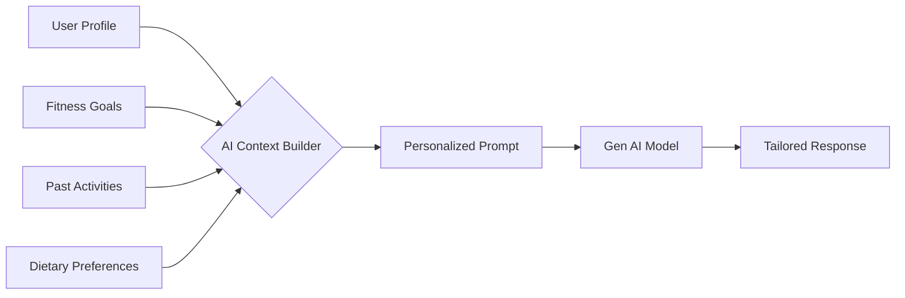
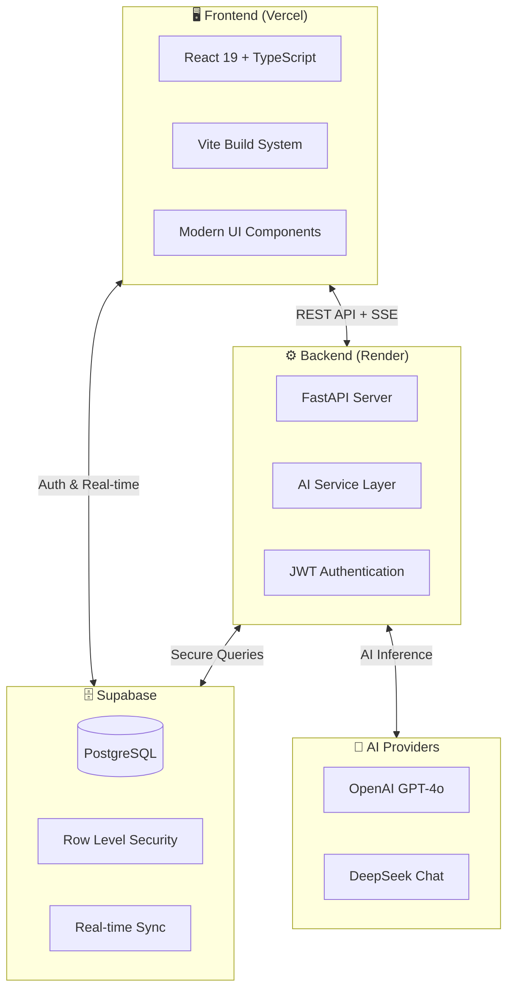
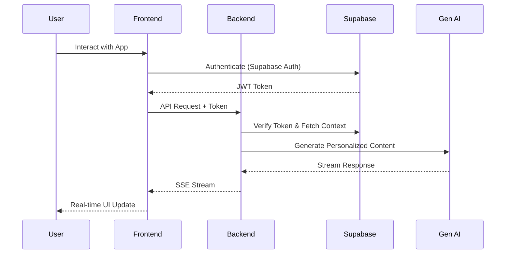
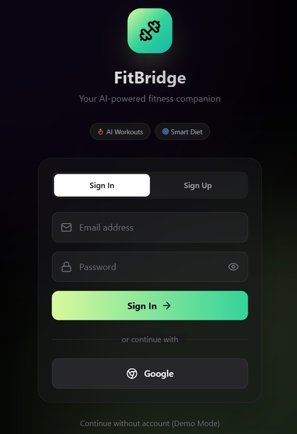
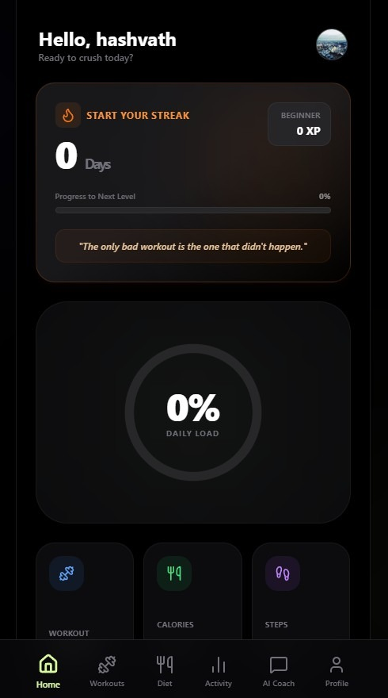
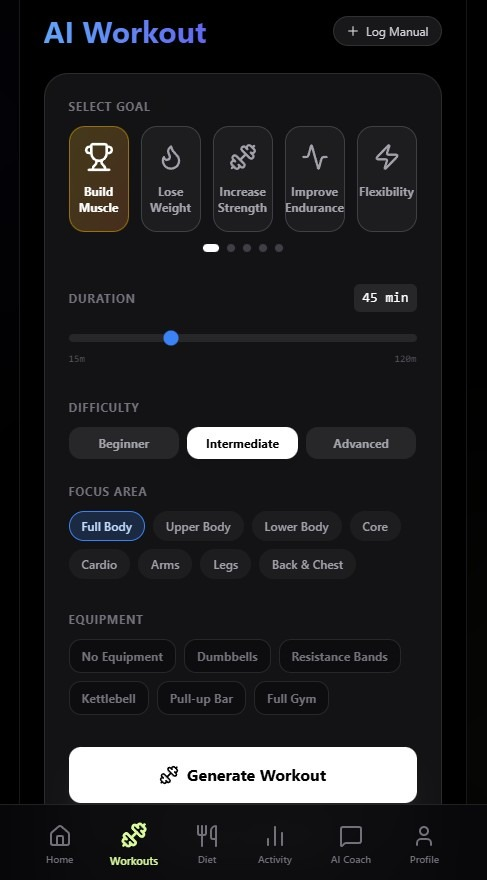
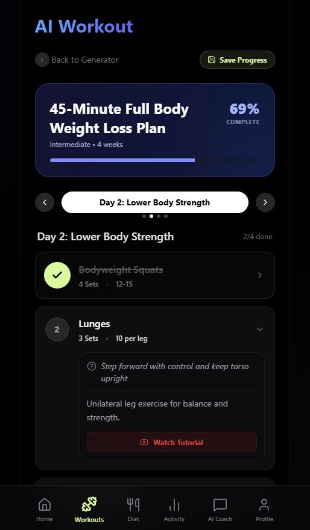
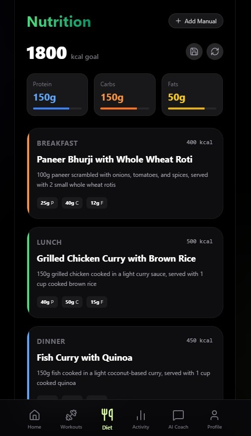
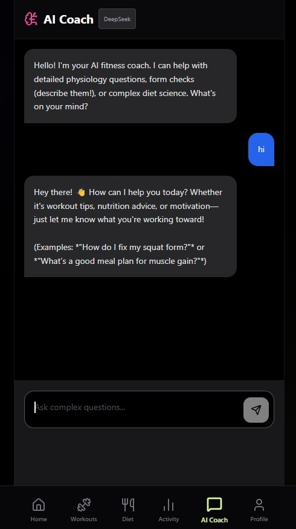

# 🏋️ FitBridge — AI-Powered Personalized Fitness Companion

<div align="center">


**Transform your fitness journey with AI that understands YOU**

[](https://fitbridge-l8518smkn-hashvanth21s-projects.vercel.app/)
[](https://fitbridge-api.onrender.com/health)
[](LICENSE)

</div>

---

## 🎯 Problem Statement

> **85% of people who start a fitness journey quit within the first 6 weeks** due to generic workout plans, lack of personalization, and absence of real-time guidance.

Traditional fitness apps offer one-size-fits-all solutions that fail to adapt to individual goals, dietary preferences, fitness levels, and cultural contexts. Users struggle with:

- ❌ Generic workout plans not suited for their body type or equipment
- ❌ Diet plans ignoring regional cuisines and dietary restrictions
- ❌ No real-time guidance when questions arise mid-workout
- ❌ Lack of motivation and accountability tracking
- ❌ Expensive personal trainers ($50-150/hour) out of reach for most

---

## 💡 Our Solution: FitBridge

FitBridge leverages **Generative AI** to democratize access to personalized fitness coaching, making professional-grade guidance accessible to everyone.

### How We're Different

| Traditional Apps           | FitBridge (Gen AI Powered)                                              |
| -------------------------- | ----------------------------------------------------------------------- |
| Static workout templates   | **Dynamic AI-generated plans** adapting to user goals                   |
| Generic Western diet plans | **Culturally-aware meal plans** (Indian, Mediterranean, Asian cuisines) |
| FAQ-based help             | **Real-time AI coach chat** with streaming responses                    |
| No personalization         | **Learns from user progress** and adjusts recommendations               |
| Expensive subscriptions    | **Cost-optimized AI** using multi-model strategy                        |

---

## ✨ Key Features

### 🤖 **AI Workout Generation**

Personalized workout routines generated based on:

- User's fitness level (Beginner → Advanced)
- Available equipment (Home/Gym/Bodyweight)
- Specific goals (Muscle Gain, Fat Loss, Endurance, Flexibility)
- Time constraints and schedule preferences

### 🥗 **AI Diet Planning**

Smart meal planning that considers:

- Daily caloric needs with macro breakdown
- Regional cuisine preferences (Indian, Mediterranean, Asian, Western)
- Dietary restrictions (Vegetarian, Vegan, Gluten-free, Halal)
- Budget and ingredient availability

### 💬 **Real-Time AI Coach**

Interactive chat with streaming responses for:

- Form correction tips and exercise guidance
- Nutrition queries and meal suggestions
- Motivation and progress insights
- Instant answers to fitness questions

### 🔥 **Gamified Progress System**

Engagement mechanics that drive consistency:

- **Streak Tracking** — Daily workout completion rewards
- **XP & Levels** — Earn points for every activity logged
- **Progress Analytics** — Visual charts for weight, strength, and habits

---

## 🧠 Innovation & Technical Highlights

### Multi-Model AI Strategy

```
┌─────────────────────────────────────────────────────────────┐
│                    SMART MODEL ROUTING                       │
├─────────────────────────────────────────────────────────────┤
│  User Request → AI Router → Optimal Model Selection         │
│                                                             │
│  ┌─────────────┐    ┌─────────────┐    ┌─────────────┐     │
│  │   OpenAI    │    │  DeepSeek   │    │    Mock     │     │
│  │   GPT-4o    │    │    Chat     │    │   (Offline) │     │
│  │  (Premium)  │    │  (Economic) │    │   (Backup)  │     │
│  └─────────────┘    └─────────────┘    └─────────────┘     │
│                                                             │
│  ✓ Automatic failover between providers                    │
│  ✓ Cost optimization (up to 90% cost reduction)            │
│  ✓ Graceful degradation with mock responses                │
└─────────────────────────────────────────────────────────────┘
```

### Streaming AI Responses

Unlike traditional request-response patterns, FitBridge uses **Server-Sent Events (SSE)** for real-time streaming, providing:

- ⚡ Instant feedback (first token in <500ms)
- 🎯 Better UX with progressive content display
- 💬 Natural conversational experience

### Personalization Engine


```mermaid
flowchart LR
    A[User Profile] --> B{AI Context Builder}
    C[Fitness Goals] --> B
    D[Past Activities] --> B
    E[Dietary Preferences] --> B
    B --> F[Personalized Prompt]
    F --> G[Gen AI Model]
    G --> H[Tailored Response]
```

---

## 🏗️ System Architecture

### High-Level Overview


```mermaid
flowchart TB
    subgraph Client["🖥️ Frontend (Vercel)"]
        React["React 19 + TypeScript"]
        Vite["Vite Build System"]
        UI["Modern UI Components"]
    end

    subgraph Backend["⚙️ Backend (Render)"]
        FastAPI["FastAPI Server"]
        AIService["AI Service Layer"]
        Auth["JWT Authentication"]
    end

    subgraph Database["🗄️ Supabase"]
        PostgreSQL[("PostgreSQL")]
        RLS["Row Level Security"]
        Realtime["Real-time Sync"]
    end

    subgraph AI["🤖 AI Providers"]
        OpenAI["OpenAI GPT-4o"]
        DeepSeek["DeepSeek Chat"]
    end

    Client <-->|"REST API + SSE"| Backend
    Client <-->|"Auth & Real-time"| Database
    Backend <-->|"Secure Queries"| Database
    Backend <-->|"AI Inference"| AI
```

### Request Flow


```mermaid
sequenceDiagram
    participant U as User
    participant F as Frontend
    participant B as Backend
    participant S as Supabase
    participant AI as Gen AI

    U->>F: Interact with App
    F->>S: Authenticate (Supabase Auth)
    S-->>F: JWT Token
    F->>B: API Request + Token
    B->>S: Verify Token & Fetch Context
    B->>AI: Generate Personalized Content
    AI-->>B: Stream Response
    B-->>F: SSE Stream
    F-->>U: Real-time UI Update
```

---

## 🛠️ Tech Stack

| Layer          | Technology                 | Why This Choice                               |
| -------------- | -------------------------- | --------------------------------------------- |
| **Frontend**   | React 19, TypeScript, Vite | Modern, fast builds, type safety              |
| **Backend**    | Python, FastAPI            | Async support, OpenAPI docs, fast development |
| **Database**   | Supabase (PostgreSQL)      | Real-time sync, RLS, hosted auth              |
| **AI**         | OpenAI GPT-4o, DeepSeek    | Quality + cost optimization                   |
| **Deployment** | Vercel + Render            | Auto-scaling, zero-config deploys             |
| **Testing**    | Vitest, pytest             | Fast testing, full coverage                   |
| **CI/CD**      | GitHub Actions             | Automated quality gates                       |

---

## 📈 Scalability & Feasibility

### Production-Ready Architecture

| Aspect       | Implementation      | Scalability                               |
| ------------ | ------------------- | ----------------------------------------- |
| **Compute**  | Render auto-scaling | Handles traffic spikes automatically      |
| **Database** | Supabase PostgreSQL | Scales to 100K+ users on Pro plan         |
| **CDN**      | Vercel Edge Network | <50ms latency globally                    |
| **AI Costs** | Multi-model routing | 90% cost reduction with DeepSeek fallback |
| **Auth**     | Supabase Auth       | Industry-standard, handles millions       |

### Cost Analysis

```
Monthly Cost Estimate (1,000 active users):
├── Vercel (Frontend)      : $0 (Free tier)
├── Render (Backend)       : $7/month (Starter)
├── Supabase (Database)    : $0 (Free tier, 500MB)
├── AI API Costs           : ~$20-50/month (with DeepSeek optimization)
└── Total                  : ~$30-60/month
    Per User Cost          : $0.03-0.06/user/month
```

### Security Features

- ✅ **Row Level Security (RLS)** — Data isolation at database level
- ✅ **JWT Authentication** — Secure token-based auth
- ✅ **CORS Configuration** — Controlled API access
- ✅ **Environment Secrets** — No hardcoded credentials

---

## 🚀 Quick Start

### Prerequisites

```bash
Node.js 20+  |  Python 3.10+  |  npm 10+
```

### Installation

```bash
# Clone the repository
git clone https://github.com/your-org/fitbridge.git
cd fitbridge

# Frontend setup
npm install
cp .env.example .env

# Backend setup
cd backend
python -m venv venv
venv\Scripts\activate    # Windows
pip install -r requirements.txt
cp .env.example .env

# Start development servers
cd ..
npm run dev              # Frontend: http://localhost:5173
# In another terminal:
cd backend && uvicorn app.main:app --reload  # Backend: http://localhost:8000
```

### Environment Variables

<details>
<summary>📋 Click to expand configuration</summary>

#### Frontend (`.env`)

| Variable                 | Description            |
| ------------------------ | ---------------------- |
| `VITE_API_URL`           | Backend API URL        |
| `VITE_SUPABASE_URL`      | Supabase project URL   |
| `VITE_SUPABASE_ANON_KEY` | Supabase anonymous key |

#### Backend (`backend/.env`)

| Variable                    | Description                          |
| --------------------------- | ------------------------------------ |
| `SUPABASE_URL`              | Supabase project URL                 |
| `SUPABASE_SERVICE_ROLE_KEY` | Supabase service role key            |
| `AI_PROVIDER`               | `openai` or `deepseek`               |
| `OPENAI_API_KEY`            | OpenAI API key (if using OpenAI)     |
| `DEEPSEEK_API_KEY`          | DeepSeek API key (if using DeepSeek) |
| `JWT_SECRET`                | JWT signing secret                   |
| `CORS_ORIGINS`              | Allowed frontend origins             |

</details>

---

## 🧪 Testing & Quality

```bash
# Frontend tests
npm run test:run          # Run all tests
npm run test:coverage     # Generate coverage report

# Backend tests
cd backend
python -m pytest tests/ -v --cov=app
```

### Quality Gates

| Check      | Command                 | Threshold    |
| ---------- | ----------------------- | ------------ |
| Unit Tests | `npm run test:run`      | 100% passing |
| Coverage   | `npm run test:coverage` | >70%         |
| Linting    | `npm run lint`          | 0 errors     |
| Type Check | `tsc --noEmit`          | 0 errors     |

---

## 📁 Project Structure

```
fitbridge/
├── 📱 components/           # React UI Components
│   ├── Dashboard.tsx        # Main analytics dashboard
│   ├── WorkoutTab.tsx       # AI workout generation
│   ├── DietTab.tsx          # AI diet planning
│   ├── ChatTab.tsx          # AI coach chat
│   └── ProfileTab.tsx       # User profile & settings
├── 🔧 services/             # API clients & utilities
├── 🧪 tests/                # Frontend test suites
├── ⚙️ backend/              # FastAPI Backend
│   ├── app/
│   │   ├── routers/         # API endpoints
│   │   │   ├── ai.py        # AI generation routes
│   │   │   ├── chat.py      # Chat streaming routes
│   │   │   ├── workout.py   # Workout CRUD
│   │   │   └── diet.py      # Diet CRUD
│   │   └── services/        # Business logic
│   │       └── ai_service.py # Multi-model AI service
│   └── tests/               # Backend test suites
├── 📚 docs/                 # Documentation
└── 🔄 .github/workflows/    # CI/CD pipelines
```

---

## 🎥 Demo & Screenshots

### 🌐 Live Demo

**[👉 Try FitBridge Now](https://fitbridge-l8518smkn-hashvanth21s-projects.vercel.app/)**

### 📱 App Preview

<div align="center">

<table>
<tr>
<td align="center"><br/><b>Login</b><br/>Modern auth with Google SSO</td>
<td align="center"><br/><b>Dashboard</b><br/>Streaks, XP & daily progress</td>
<td align="center"><br/><b>AI Workout Generator</b><br/>Customizable goals & options</td>
</tr>
<tr>
<td align="center"><br/><b>Generated Plan</b><br/>AI-created exercises with tutorials</td>
<td align="center"><br/><b>Smart Diet</b><br/>Regional cuisine (Indian, etc.)</td>
<td align="center"><br/><b>AI Coach Chat</b><br/>Real-time DeepSeek integration</td>
</tr>
</table>

</div>

### API Documentation

**[📖 Interactive API Docs](https://fitbridge-api.onrender.com/docs)**

---

## 🗺️ Roadmap

### ✅ Phase 1: Foundation (Complete)

- [x] Core workout/diet logging
- [x] AI plan generation with multi-model support
- [x] Streak system & gamification
- [x] Real-time AI chat with streaming
- [x] Supabase integration with RLS
- [x] CI/CD pipeline

### 🔄 Phase 2: Enhancement (In Progress)

- [ ] Voice input for hands-free logging
- [ ] Progress photo analysis with GPT-4 Vision
- [ ] Workout templates library
- [ ] Export data (CSV/PDF)

### 📅 Phase 3: Scale (Planned)

- [ ] React Native mobile app
- [ ] Apple Health / Google Fit integration
- [ ] Push notifications
- [ ] Multi-language support

---

## 📄 License

This project is licensed under the MIT License - see the [LICENSE](LICENSE) file for details.

---

<div align="center">

Built with ❤️ for the next gen evolution ⌨️
[](https://github.com/your-org/fitbridge)

</div>
